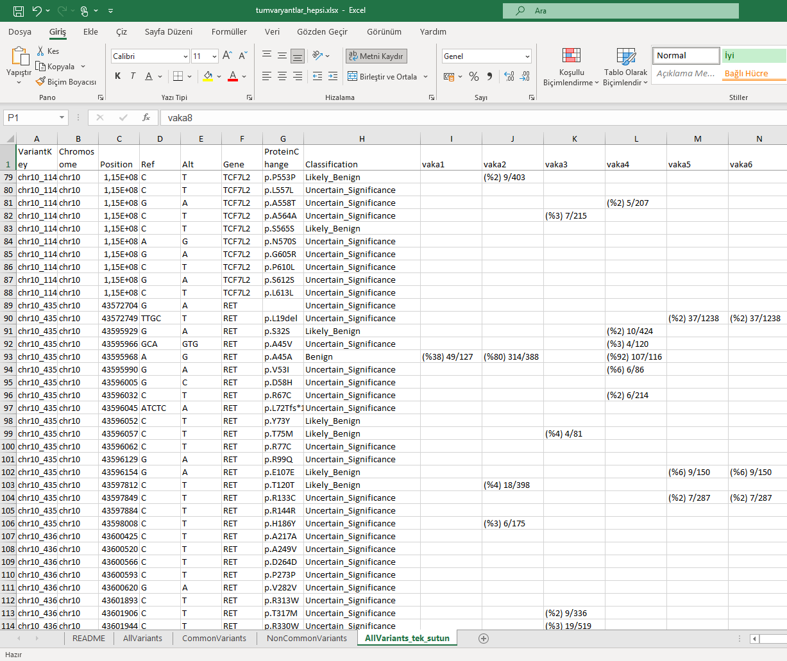

# 🧬 NGS Varyant Analiz Aracı (VCF to Excel)

Bu uygulama, **QIAGEN Clinical Insight** gibi araçlardan çıkan `.vcf` formatındaki varyant dosyalarını seçip, filtreleyip, Excel çıktısı halinde **otomatik raporlayan** bir grafik arayüz (GUI) sunar.

---

## 🎯 Özellikler

- 🧪 Çoklu `.vcf` dosyası seçimi
- 📊 Her vaka için 3 ayrı metrik: **DP** (total okuma), **AD** (alt okuma), **Pct** (yüzde)
- 📌 Tek sütun formatı: `(%pct) ad/dp` olarak görünüm
- 📂 Dört sayfalık Excel çıktısı:
  - `AllVariants`
  - `CommonVariants`
  - `NonCommonVariants`
  - `AllVariants_tek_sutun`
- 🎚️ Filtreleme: Yüzde eşiği (%3 gibi) belirleyip yalnızca o değeri geçen varyantları dışa aktar
- ✅ Kullanıcı dostu grafik arayüz (Tkinter)
- 📌 Tüm yorumlu bilgiler `README` sayfasında yer alır

---

## 📸 Ekran Görüntüsü



---

## 🚀 Nasıl Kullanılır?

1. `Python 3` kurulu olmalı.
2. Aşağıdaki kütüphaneler kurulu olmalı:

```bash
pip install openpyxl
```

3. `tumvaryantlar.py` dosyasını çalıştır:

```bash
python tumvaryantlar.py
```

4. Açılan arayüzde:
   - `.vcf` dosyalarını seçin.
   - Minimum yüzde eşiğini girin (örn: 5).
   - Excel dosyasını nereye kaydedeceğinizi seçin.
   - Dosya oluşturulduğunda size bildirilecektir.

---

## 📁 Excel Çıktısı Açıklamaları

| Sayfa Adı              | İçerik                                                                          |
|------------------------|----------------------------------------------------------------------------------|
| `AllVariants`          | Tüm varyantlar. Her vaka için DP, AD, Pct ayrı sütunlarda                       |
| `CommonVariants`       | Tüm vakalarda ortak görülen varyantlar                                          |
| `NonCommonVariants`    | Sadece bazı vakalarda görülen varyantlar                                        |
| `AllVariants_tek_sutun`| Her vaka için tek hücrede görünüm: `(%11) 11/100` gibi                          |
| `README`               | Açıklamalar, eşik bilgisi ve sütun açıklamaları                                 |

---

## 📄 Lisans

Bu proje MIT lisansı ile sunulmuştur.  
Herhangi bir kurum veya laboratuvar kullanımı için uygundur.
